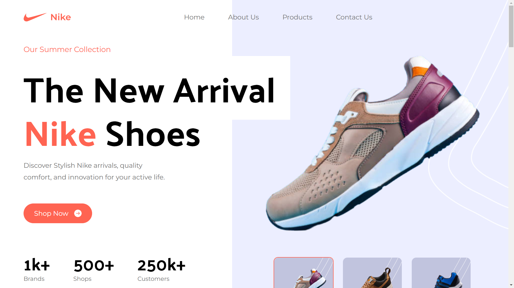
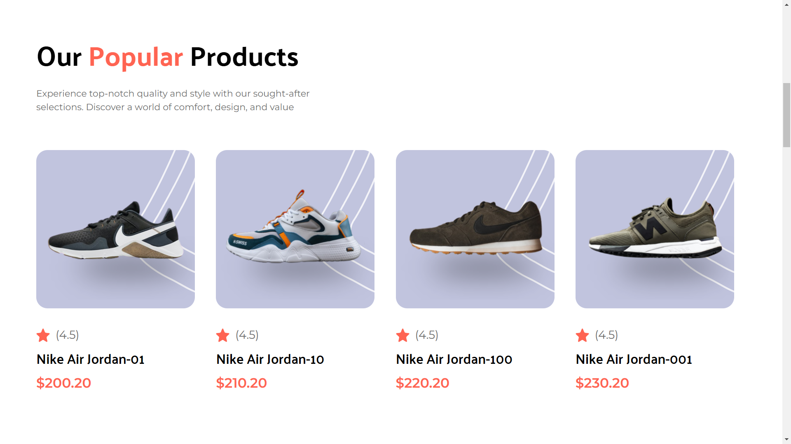
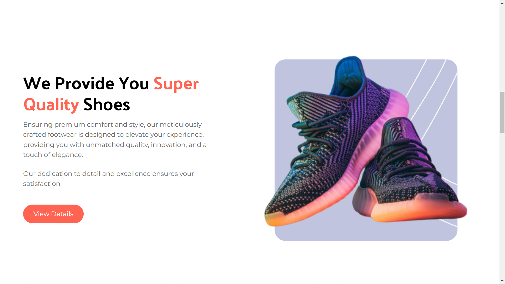
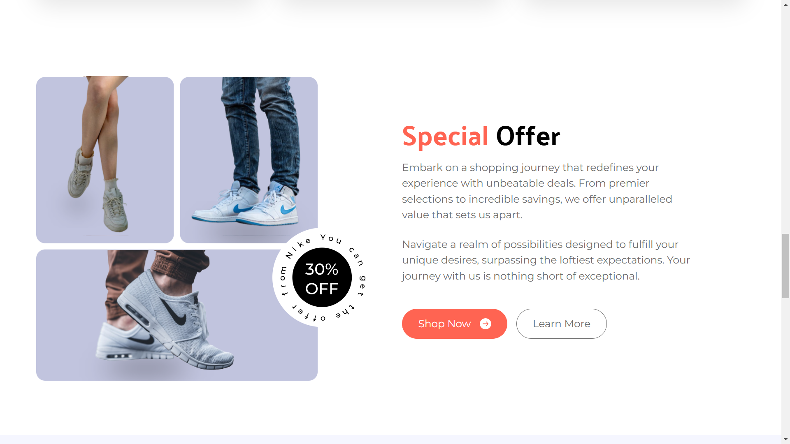
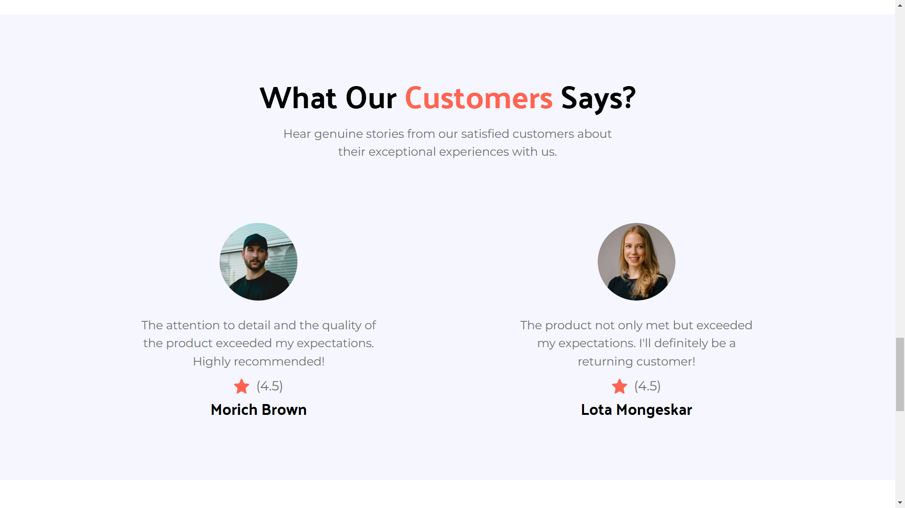
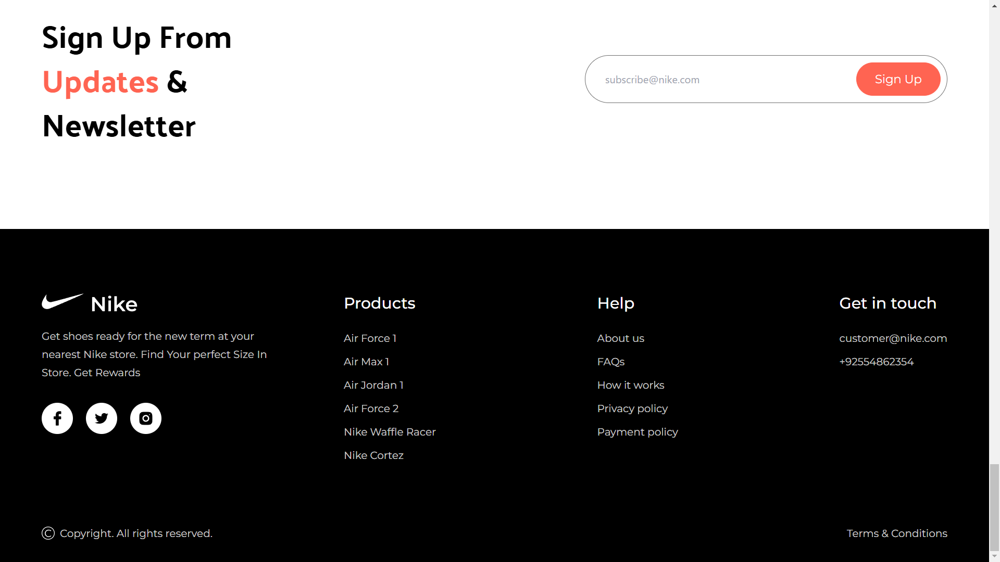

# Project Footwear World

This is a clone of the popular Nike website. Nike.com is an Online Shopping Site for Footwear and Apparel. I have made it fully functional using React, JavaScript, HTML, and Tailwind CSS, providing a responsive and smooth user experience.

### Deployed Link:

https://project-footwear-world.netlify.app/

### Tech-Stack Used:

- React.js
- Tailwind CSS
- JavaScript
- HTML
- CSS

### Screenshots:

